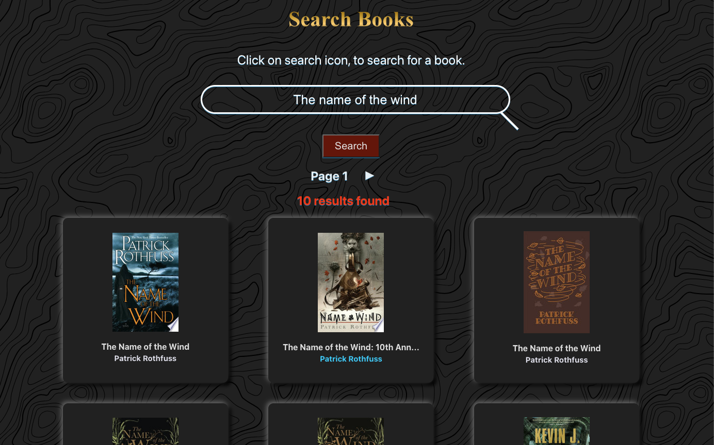
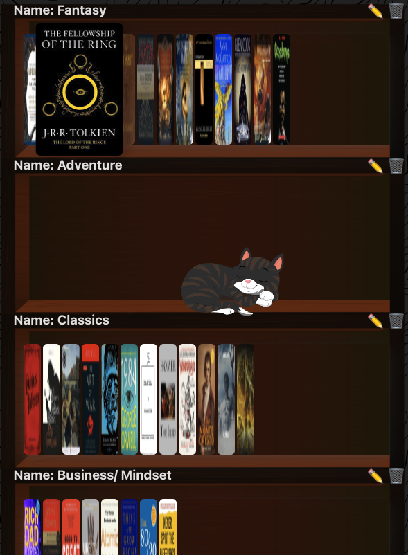

# [Fantastic Books](https://fantastic-books.netlify.app/)
<p>And where to find them.</p>

### [Check it out here!](https://fantastic-books.netlify.app/)


##### Table of Contents
<details>
<summary> Click to Expand</summary>

- [Screen Shots](#screen-shots)
- [What is this?](#what-is-this)
- [Getting Started](#getting-started)
- [The Devs](#the-devs)
- [Highlights](#highlights)
- [Attributions](#attributions)
- [Technologies Used](#technologies-used)
- [Next Steps](#next-steps)

</details>
<br>

## Screen Shots

###### The Book Search:


###### Shelves in the Profile:


## What is this?

Fantastic Books is a MERN stack CRUD app that makes it convenient to keep track of your all the books you will need for all you bibliophilic delights! Dive 20,000 leagues into a personalized reading journey, where you can create custom shelves to curate your tales of wonder and mystery. Whether you're charting the realms of books you've journeyed through, setting sail to the titles on your next adventure list, or unearthing niche categories from the forgotten corners of literature, our platform is your one stop shop for all you will need on you adventure!

## Getting Started
[Fantastic books: The App](https://fantastic-books.netlify.app/)
<br />
[Check out our Trello board here!](https://trello.com/b/AJpyaYO6/fantastic-books-and-where-to-find-them)
<br />
If you are curious about what our back end looks like - [Fantastic Books: The Back End](https://github.com/nonchalamment/magnolia-back-end/)

## The Devs

#### Scrum Manager and Styler:  
## Carla Pacheco  
#### [Github](https://github.com/andrewmorrisondev) [Linked In](https://www.linkedin.com/in/thecarlapacheco/)
<br />

#### Api Manager and Git Comander
## Enes Velovic  
#### [Github](https://github.com/nonchalamment) [Linked In](https://www.linkedin.com/in/enesvelovic/)
<br />

#### Database Manager and Documentor
## Steve Morrison  
#### [Github](https://github.com/trentonwahr) [Linked In](https://www.linkedin.com/in/steven-ansman-morrison/)

## Highlights

<details>
<summary> Click to Expand</summary>

###### Carla: 
```dotnetcli
await Profile.populate(newComment, { path: 'commenter' })
    const existingBook = await Book.findOne({ googleId: bookDetails.googleId })
    // const profile = await Profile.findById(req.user.profile)
    if (existingBook) {
      existingBook.comments.push(newComment);
      await existingBook.save();
    } else {
      const newBook = new Book({
        title: bookDetails.title ? bookDetails.title : '',
        subtitle: bookDetails.subtitle ? bookDetails.subtitle : '',
        authors : bookDetails.authors ? bookDetails.authors : [],
        cover: bookDetails.cover ? bookDetails.cover : '',
        published: bookDetails.published ? bookDetails.published : '',
        description: bookDetails.description ? bookDetails.description : '',
        pages: bookDetails.pages ? bookDetails.pages : 0,
        categories: bookDetails.categories ? bookDetails.categories : [],
        url: bookDetails.url ? bookDetails.url : '',
        googleId: bookDetails.googleId,
        comments: [newComment]
      })

      newBook.comments.push(newComment)
      await newBook.save();
    }
    ('BOOKDETAILS:',bookDetails)
    ('waffle', newComment)
    ('SHOWS NEWCOMMENT COMMENTER', newComment.commenter)
    // newComment.commenter = profile
    res.status(201).json(newComment);
  } catch (err) {
    (err);
    res.status(500).json(err);
  }
```

###### Enes:

```
return (
    <main>
      {profile ? (
        <div>
          <div className={styles.spacer}/>
          
          <h1 className={styles.name}>{profile.name}</h1>
          <div className={styles.container}>
          <div className={styles.toggleContainer}>
            <input
              type="checkbox"
              className={styles.funCheckbox}
              id="funCheckbox"
              checked={darkMode}
              onChange={handleDarkModeChange}
            />
            <label htmlFor="funCheckbox" className={styles.funCheckboxLabel}>
              <i className="fas fa-moon"></i>
              <i className="fas fa-sun"></i>
              <span className={styles.funCheckboxThumb}></span>
            </label>
          </div>
          </div>
          {showButton && (
            <button
              className={styles.b68}
              onClick={() =>
                setModalData({
                  isOpen: true,
                  isEditing: false,
                  name: "",
                  id: null,
                  placeholder: "Shelf Name",
                })
              }
            >
              New Shelf
            </button>
          )}
          {profile.shelves.map((shelf) => (
            <div className={styles.shelf} key={shelf._id}>
              <div className={styles.shelfNavigation}>
                <button
                  className={styles.arrowButton}
                  onMouseEnter={() =>
                    setTimeout(() => handleScrollOnHover(shelf._id, -1), 150)
                  }
                  onMouseLeave={() => stopScrollOnHover(shelf._id)}
                  onClick={() => scrollBookContainer(shelf._id, -1)}
                >
                  ⬅️
                </button>
                <div className={styles.shelfContent}>
                  <span className={styles.shelfName}>
                    <span
                      className={styles.tooltip}
                      data-title={shelf.name}
                      tooltip={shelf.name}
                    >
                      Name:{" "}
                      {shelf.name.length > 20
                        ? `${shelf.name.substring(0, 28)}...`
                        : shelf.name}
                    </span>
                  </span>
                  <div
                    className={styles.bookContainer}
                    ref={(ref) => (bookContainerRefs.current[shelf._id] = ref)}
                  >
                  {currentBooks[shelf._id]?.map((book) => (
                    
                  ))}
                  {shelf.books?.length === 0 && (
                    
                    )}
                  </div>
                </div>
                <button
                  className={styles.arrowButton}
                  onMouseEnter={() =>
                    setTimeout(() => handleScrollOnHover(shelf._id, 1), 200)
                  } // 0.2s delay
                  onMouseLeave={() => stopScrollOnHover(shelf._id)}
                  onClick={() => scrollBookContainer(shelf._id, 1)}
                >
                  ➡️
                </button>
              </div>
              <div className={styles.shelfActions}>
                <button
                  className={styles.edit}
                  onClick={() =>
                    setModalData({
                      isOpen: true,
                      isEditing: true,
                      name: shelf.name,
                      id: shelf._id,
                    })
                  }
                >
                  ✏️
                </button>
                <button
                  className={styles.delete}
                  onClick={() => handleDeleteShelf(shelf._id)}
                >
                  🗑️
                </button>
              </div>
              {modalData.isEditing && modalData.id === shelf._id && (
                <div className={styles.modalOpen}>
                  <label className={styles.input}>
                    Edit Shelf Name:
                    <input
                      className={styles.input}
                      ref={inputRef}
                      type="text"
                      value={modalData.name}
                      onChange={(e) =>
                        setModalData({ ...modalData, name: e.target.value })
                      }
                    />
                  </label>
                  <button
                    className={styles.b68}
                    onClick={() => handleShelf("editShelf", shelf._id)}
                  >
                    Save
                  </button>
                  <button
                    className={styles.b68}
                    onClick={() =>
                      setModalData({
                        isOpen: false,
                        name: "",
                        isEditing: false,
                        id: null,
                      })
                    }
                  >
                    Cancel
                  </button>
                </div>
              )}
            </div>
          ))}
          {modalData.isOpen && !modalData.isEditing && (
            <div className={styles.modalOpen}>
              <label>
                Shelf Name:
                <input
                  className={styles.newShelf}
                  ref={inputRef}
                  type="text"
                  value={modalData.name}
                  onChange={(e) =>
                    setModalData({ ...modalData, name: e.target.value })
                  }
                />
              </label>
       
      <button
        className={styles.b68}
        onClick={() => handleShelf("createShelf")}
      >
        Create
      </button>

              <button
                className={styles.b68}
                onClick={() =>
                  setModalData({
                    isOpen: false,
                    name: "",
                    isEditing: false,
                    id: null,
                  })
                }
              >
                Cancel
              </button>
            </div>
          )}
        </div>
      ) : (
        <p>
          Loading...
        </p>
      )}
    </main>
  );
};
```

###### Steve: Landing.module.css
```
.landingTitle {
  background-color: #242424; 
  border-radius: 10px;
  width: 80%;
  -webkit-background-clip: text;
  -webkit-text-fill-color: transparent;
  animation: fade 2s ease-in;
}

@keyframes fade {
  0% {
    opacity: 0;
  }
  100% {
    opacity: 1;
  }
}

.landingSubTitle {
  background: #c90205;
  font-family:'Times New Roman', Times, serif;
  font-size: 32px;
  margin-bottom: 200px;
  -webkit-background-clip: text;
  -webkit-text-fill-color: transparent;
  animation: slowFade 4s ease-in;
}

@keyframes slowFade {
  0% {
    opacity: 0;
  }
  50% {
    opacity: 0;
  }
  100% {
    opacity: 1;
  }
}
```
</details>
<br>

## Attributions
[Google Books api](https://developers.google.com/books)  
[Hero Pattern](https://heropatterns.com/)  
[Animales Fantastic Font](https://www.fontspace.com/category/fantastic-beasts-and-where-to-find-them)  
[Favicon](https://www.flaticon.com/free-icons/thunder)


## Technologies Used


<ul>
  <li>AJAX</li>
  <li>Cloudinary</li>
  <li>Fly.io</li>
</ul>

## Next Steps
We have plans to implement a blog style forum where users can post requests for advice on what they should read next of share their opinions ona book they think... or don't think others should read. 

Additionally, within blogs we want the user to be able to link to shelves or book details from within the forum. This way they can add books they are interested in reading right to a shelf from the forum.

In shelves we would like to add a privacy toggle so that only the user a shelf belongs to could look at it's content if they want it to be that way.

We would also like to implement a color system into our app so that users can choose the color of the backdrop and other various elements to best match their reading mood. This could also include light and dark mode settings.
